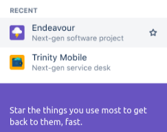
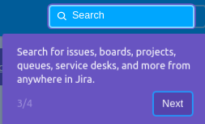
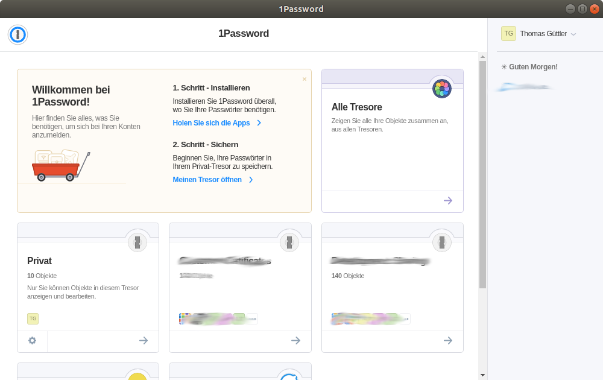

# Usability

Screenshots and anecdotes where software made me think. Thinking hurts - I want to avoid it.

This page is my personal barf bag where I write down my dissatisfaction concerning missing usability.

## Invoices via email which don't contain details

Useless complicated No 1: The email contains a PDF. All details are in the PDF. Grrrr I need to open the PDF first.

Useless complicated No 2: The email contains a link to a web-page. There I can find the details. Grrrrr

## Desktop Usability

my personal point of view.

- enlarging the mouse coursor should very easy
- the default action should be visible very well. For example the button which gets "pressed" if I hit ENTER.
- ctrl-plus ctrl-minus should increase/decrease the text size in every application.

## Ubuntu/Gnome

Nautilus images can not be displayed big. Too small for me:

https://askubuntu.com/questions/1097934/nautilus-show-images-with-more-than-200-size

Gimp: Open jpg/png edit it. Save it. Annoying: Gimp wants to force you into is own image format. The gimp developers know it better than I do. They know what's good for me: a lossless image format. No, this is useless. Most average users want to open a jpg/png edit it, and save a jpg/png again. Experts want a lossless data format. The way of the average user should be the default. Experts can handle this their way.

double-click on a word should mark the thing in all applications. If I double-click on the "o" in path /blu/foo/bar Firefox does mark "foo". In a gnome-terminal the whole path gets selected. This is annoying. Here is how to fix Firefox double-click behaviour: http://kb.mozillazine.org/Layout.word_select.stop_at_punctuation I think Firefox's default should get fixed. Selecting a file path is very common. Chrome has the same strange default like Firefox.

## Gnome panel

### Gnome panel: date stops at end of month.

Today is tuesday July 30. I want to know the date of the next tuesday.
I click on the time symbol at the top of the scree an see this:

... grrr I don't see that the next tuesday is July 6th.

### Gnome panel: Show date next to time

How do I show date next to time in the panel with gnome-shell? https://askubuntu.com/questions/83597/how-do-i-show-date-next-to-time-in-the-panel-with-gnome-shell The current solutions are way too complicated. I want a solution which gets found by a grandma without using google. It should be simple in the spirit of "don't make me think".

## Server

### /usr/bin/systemctl vs /bin/systemctl

Ubuntu uses /bin/systemctl. SuSE /usr/bin/systemctl. No problem? It is annoying if you want to write sudo-rules which work on both distributions.

### Package name differ

Package names differ across linux distributions. Containers improve this, since this reduces the need to make things portable.

## Slack

### Links: Which channel?

Slack links to a message look like this: `https://yourname.slack.com/archives/GSCDS5XCN/p1783140488002900``
It would make sense that you can at least guess which channel this message belongs to.

## Confluence: Search URLs. Session id gets added to URL

If I search for this, the URL does no change: https://www.google.com/search?q=foo

If I open this URL in confluence, then I get redirected:

https://example.atlassian.net/wiki/search?text=foo

https://example.atlassian.net/wiki/search?text=foo&search_id=ca1db899-49a9-4f2d-88d9-eaa36ac1c1dc

That's not nice. I want to send the URL via mail/slack/... the first URL is nice, the second is ugly.

## Jira: Star things you use often ... Why should I?

Jira has a new user interface. I have a look at the introduction "Star the things you use most to get to them, fast".

Wow (joking) .... why? Why should star things? Why can't Jira just count what I use the most? Then I don't need to star things.

## Jira Search .. Why not in Confluence?

Jira has a new user interface. I have a look at the introduction... Why can't both tools (Jira and Confluence) which are both from the same company have a combined search?

I use just one search world wide internet engine for almost everything. I don't use search-engine-foo for books and search-engine-bla for blog posts and search-engine-blu for events in my city. I use **one**.

Why is this for company wide intranet search different?

# Gimp does not remember my last brush.

I often paint on screenshots to highlight parts. I like a 4 pixel pink brush fot this.

Unfortunately Gimp does not remember my last setting. Again and again, after starting Gimp
it is 20 pixel and black. Grrrr why can't Gimp remember my last setting?

# 1Password: I don't want to remember the container, I want type

The password manager 1password works fine for usual password of web pages.

But if a page uses basic-auth I receive this strange popup. 

Now I open 1password and see this:

That's not what I want. I want a search field with autocomplete.

If I open 1password I want the cursor to be in this autocomplete field.

I don't want to remeber in which container the password is.
